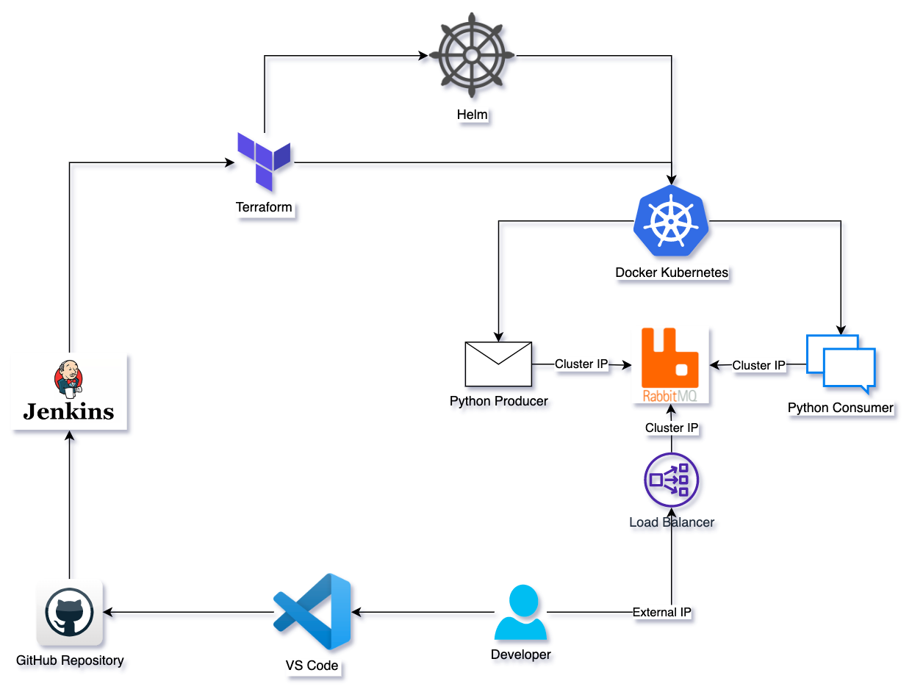

# devops-task-2
adesso DevOps Task 2



1. Install Docker Desktop first, then enable Kubernetes from Settings
2. Configure your ```~/.kube/config``` file with your docker-desktop config
2. You need an Azure or similar Cloud service account to create a remote storage for Terraform backend.
3. Edit and run ```create-remote-storage.sh``` to create a storage for Terraform backend. Edit STORAGE_ACCOUNT_NAME and run. It will prompt for ```az login``` command, follow the opened browser window and login
4. You can also run ```az login``` command manually
5. After creating storage, terraform backend config variables should be configured in ```main.tf```. Update ```backend "azurerm"``` block with your backend storage values


## Jenkins ##
- Any preffered Jenkins controller could be used 

- Your repository token (e.g. Github) and following credentials should have been stored as secret texts into Jenkins Credentials Manager. This way, they could be kept as encrypted and used as environment values for Terraform to Access Azure services

```
environment {
    ARM_TENANT_ID = credentials('AzureTenantID')
    ARM_CLIENT_ID = credentials('AzureClientID')
    ARM_CLIENT_SECRET = credentials('AzureClientSecret')
    ARM_SUBSCRIPTION_ID = credentials('AzureSubscriptionID')
}
```

## Producer and Consumer Apps ##
- The python apps were containerised with Docker and then their Helm charts were created. 
- Producer app sends a message in every 5 seconds
- Consumer app connects to RabbitMQ instance and waits for the incoming messages on specified queue 

## Notes ##
- If necessary, different commands can be used to check for the POD and Service details (such as Ports, IPs, etc)
```
kubectl get pods -w -o wide
kubectl get svc -w
```
- The infrastructure could be setup from scratch with the Terraform-Plan and Terraform-Apply jobs 
- The all infrastructure can be destroyed with ```terraform destroy``` command
